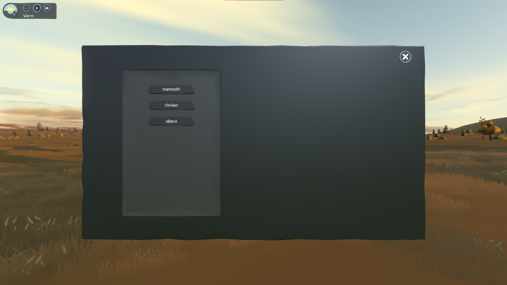

# Sapiens Creative mode

Introducing Creative Mode to the Sapiens experience! Fly as high as far as you like, instantly complete and build new structures, or grant your Sapiens skills. In general this mod transforms Sapiens from a survival god-game into a proper god-game.

`WARNING:` This mod is very much WIP, and is also being used to test the Hammerstone Framework. Some content is not yet implemented, or is intentionally in an annoying place.

## Cheat Menu

Toggle with `.`. This is mostly a test and shouldn't be considered final.

## Cheats

Enter the lua console `c` then `/lua`, and type one of the following commands:

 - `cheat:EnableInstantBuild()` - Enables instant building, including unlocking all buildables and decorations.
 - `cheat:UnlockSkill(skill)` - Unlocks the specified skill, such as 'digging' or 'spearHunting'
 - `cheat:UnlockAllSkills()` - Unlocks all skills
 - `cheat:Spawn()` - Spawn an object such as `mammoth` at your player position.

# Change Log

## 0.0.1

Creative Mode pre-release, launched in a half-finished state during the first weak of Sapiens Early Access. 

### Features
 - A 'Creative Mode' UI where you could toggle on building, digging, and ui toggles, as well as unlock all skills
 - 'Simple' instant building, which just built with a single preset resource type
 - A selection of 'cheat' commands, exposed via the sapiens `/lua` console

### Limitations
 - UI was buggy and didn't cache state
 - Could only build with one material
 - Instant Build Mode couldn't be toggled off
 
## 1.0.0

The first true release of Creative Mode, which stabilized all known bugs, and reworked many core features for a true, creative experience.

### Features
 - You can now select the resources that you would like to build with
 - The 'build' menu is now properly unlocked with the 'Unlock UI checkbox'
 - Added 'Remove' button, allowing you to delete objects such as decorations, mammoths, or trees
 - Added 'Instantly Grow' button which allows force-growing plants
 - Custom UI now properly restores state when reloading world
 - 'Make x Happy' button now allows multi-selection, among graphical improvements

### Limitations
 - UI is still lacking a lot of polish
 - No ability to set fill type when digging
 - Cannot set plants to auto-complete (must use the button on the seed mound)
 - Deleting mammoths can sometimes crash the game (often)

## 1.1.0

Thanks to 'Rae', first time contributor for authoring this update.

### Features
 - Fixed issue where removing mammoths (among other entities) crashed the game
 - Fixed bug where removing sapien caused a ghost-icon to persist until reload
 - Fixed issue where 'Max Needs' button instead set Sapiens health and happiness to zero
 - Added ability to 'Replenish' crops

### Limitations (caused by 0.4.6)
 - Replenish crops crashes game
 - 'Unlock all Skills' crashed the game
 - 'Grow Crop' crashes the game

## 1.2.0

Thanks to 'Smart-Alec', first time contributor.

### Features
 - Fixes crash when clicking 'unlock all skills'
 - Fixed crash when clicking 'instant grow'
 - Fixed crash when clicking 'replenish'
 - 

